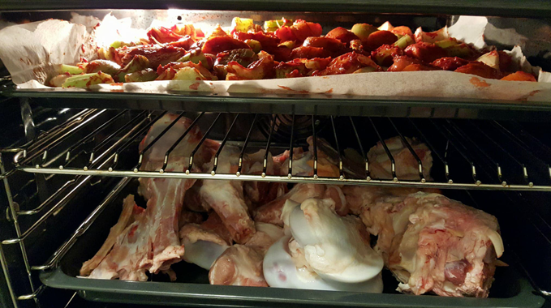

- Kości muszą być porąbane na mniejsze kawałki, tak by bez trudu mieściły się do garnka i co najważniejsze, odsłonięty był szpik kostny. Wykładamy je na blachę, nie dodajemy żadnego tłuszczu. 
- Marchew, seler i cebulę kroimy byle jak na mniejsze kawałki, po uprzednim umyciu. Nie ma potrzeby dodawania sobie roboty i obierania.
- Na drugiej blasze dajemy ze dwie łyżki oleju, wykładamy warzywa, dodajemy cały słoik koncentratu pomidorowego, mieszamy rękami, aby koncentrat był w miarę równomiernie 
- rozłożony na warzywach. 
- Obie blachy przekładamy do piekarnika nagrzanego na 230 stopni, blachę z warzywami na górze, tuż pod grzałką, blachę z kośćmi na dole piekarnika.

- Warzywa pieczemy przez jakieś 50-60 minut, aż będą ładnie przypieczone. Po tym czasie wyjmujemy blachę z warzywami, które przekładamy do garnka i zalewamy zimną wodą (aby tylko były przykryte), kości zaś umieszczamy na środku piekarnika i pieczemy jeszcze przez jakąś godzinę, półtorej, aż będą wyglądać mniej więcej tak:

- Mocno zrumienione, gdzieniegdzie wręcz przypalone. Tak ma być. Przekładamy kości do garnka (pojemność mojego to jakieś 12-15 litrów, nie wiem dokładnie, ile, jeżeli nie macie takiego litrażu, należy odpowiednio zmniejszyć proporcję, a jak macie większy, to warto te proporcje zwiększyć, bo robota z większą ilością sosu jest dokładnie taka sama, a tych pyszności wystarczy na dłużej), zalewamy zimną wodą, aby wszystkie składniki były dobrze przykryte i włączamy duży ogień, by płyn szybko się zagotował. 
- Tu jedna ważna rzecz. Na blasze zostanie nam tłuszcz i kawałki mięsa, mięsa z kością, szpiku itp. Żebyś przypadkiem nie pomyślał o wyrzucaniu tych dóbr (tłuszcz jednak można, a nawet należy wylać, ale ostrożnie, by nie stracić pozostałości które są na blasze), są po prostu zbyt cenne. Zalej blachę wodą, postaw na ogniu i podgrzewaj, w tym czasie pracując drewnianą szpatułą, by oderwać pozostałości od blachy. 
- Przelej to do garnka, całość zagotuj (można przykryć, by płyn się szybciej zagotował). Po zagotowaniu zdejmij pokrywę i gotuj na małym ogniu przez 18-24 godzin. Tak, około dwadzieścia godzin. 
- Jak zacznie ubywać płynu, dolewaj. To bardzo ważne, by wywaru w tym momencie nie przypalić. 
- Nad wywarem nie trzeba stać, wystarczy raz na jakiś czas przemieszać kości wraz z warzywami i zaglądać, czy nie odparowało za dużo płynu. Po dwudziestu godzinach nasz wywar powinien wyglądać mniej więcej tak:

- To jest moment, w którym należy odcedzić kości i warzywa, po prostu wyjąć je z sosu. 
- Przekładamy je do większego durszlaka, abyśmy mogli je jeszcze wypłukać, bo nie ma żadnego uzasadnienia dla marnowania wywaru, który siłą rzeczy musi w niewielkich ilościach pozostać na kościach i warzywach. To, co wypłuczemy, z powrotem ląduje w garnku. 
- Wywar doprowadzamy do wrzenia i redukujemy (w tym miejscu niektórzy nie redukują, ale czekają, aż wywar się schłodzi, żeby zebrać tłuszcz z wierzchu. Są różne techniki i różne metody, ja stosuję inną) To jest moment, w którym musimy już częściej doglądać naszego sosu, co jakiś czas mieszać i pilnować, aby sos się nie przypalił (niektórzy w trakcie dodają bouquet garni, czyli mieszanki przypraw, w woreczku muślinowym, niektórzy dodają czerwonego wina. Ja tego nie robię, chcę, aby sos nie był doprawiony niczym innym). Redukujemy do momentu, w którym nasz sos ładnie oblepia łyżkę, której używamy do mieszania. Sos musi być gęsty, możemy go spróbować, powinien być esencjonalny, mięsny i trochę słodkawy (co pochodzi od marchewki i selera). W tym momencie skręcam na najmniejszy ogień i zbieram pianę z tłuszczu, która pojawia się co chwilę u góry (delikatnie, aby nie wybrać przy tym sosu). Ale i to nie jest konieczne, bowiem gdy sos stężeje, również bez problemu można zebrać tłuszcz z góry. Są różne techniki, sami zdecydujecie, która jest najwygodniejsza. 
- Sięgamy po pojemnik przeznaczony do kontaktu z żywnością i gorącym płynem i przecieramy nasz sos przez metalowe sitko, bowiem może w nim być jeszcze pełno chrząstek, ukruszonych kości czy kawałków warzyw. Nasz sos powinien wyglądać mniej więcej tak:

- Czekamy chwilę, aż ostygnie i wkładamy pojemnik do lodówki na całą noc.
- Gęsta, zbita galaretka. Musimy jednak uważać, gdy go wyciągamy z pojemnika, aby w kuchni nie było zbyt gorąco, bo może zacząć się rozpuszczać i po prostu go stracimy. Tak się nie musi zdarzyć, ale może. 
- Kroimy sos w kostkę, u mnie to jest około 3x3cm, ale nie jestem przy tym super dokładny, nie ma takiej potrzeby. 
- I pakujemy w folię spożywczą, kostki zaś wkładamy do większych worków i pakujemy do zamrażarki. 
- Nasz sos jest gotowy, możemy go w ten sposób przechowywać nawet pół roku (a zdarzało mi się dłużej, chociaż z reguły po pół roku to już nie ma po nim śladu i robię nowy). 
- Jak wspominałem, można go używać niemal wszędzie tam, gdzie macie do czynienia z mięsem. Znakomicie sprawdza się jako baza do innych sosów. Dodaj go do wywaru który powstał podczas pieczenia mięsa, masz fantastyczny sos pieczeniowy. Można go dodać do gulaszu, bigosu, farszu do pierogów, ragu bolognese, chili, hamburgerów, czy jako sos do steków. Samodzielnie też się fantastycznie spisuje. Wystarczy rozpuścić go w rondlu (czy na patelni), dodać szczyptę soli i pieprzu, tyle. Można go rozrobić z redukowanym winem, też jest fenomenalny. 
